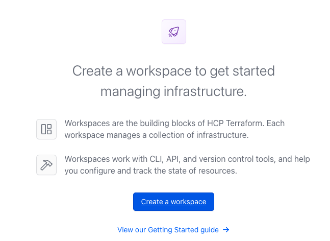
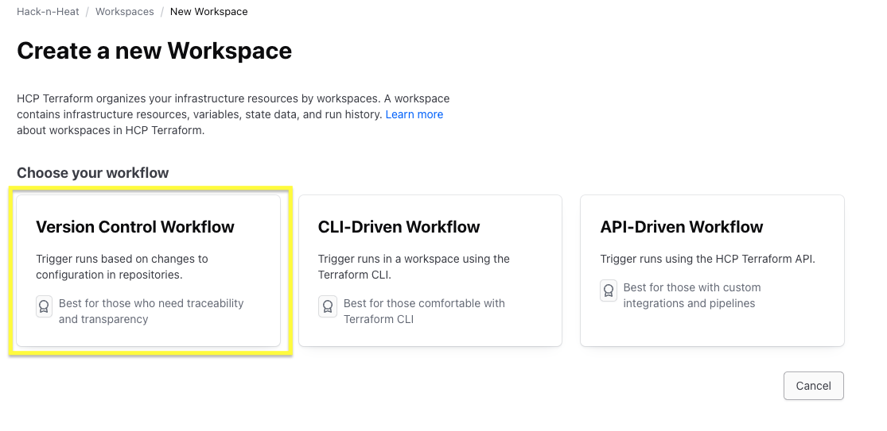
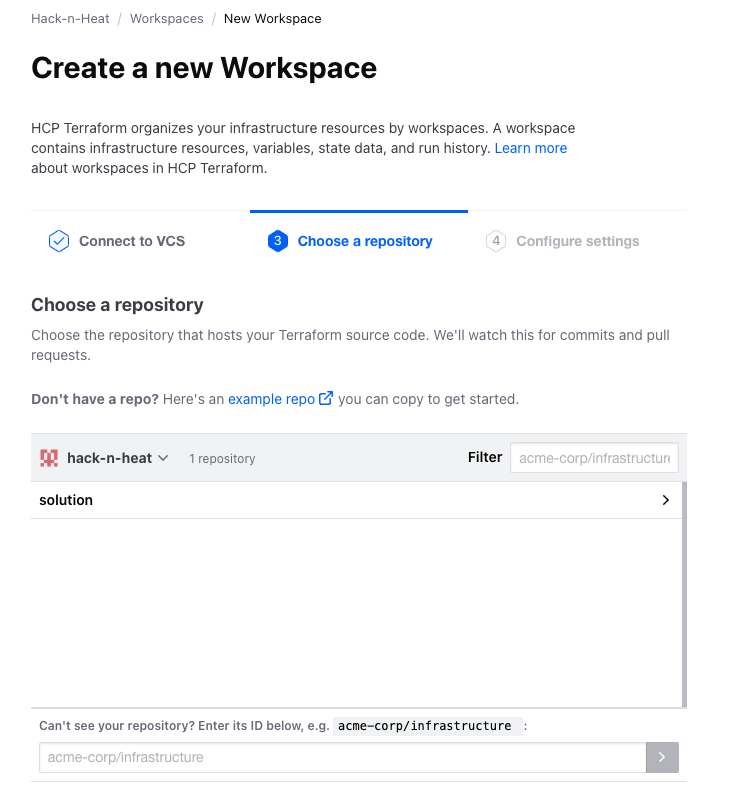
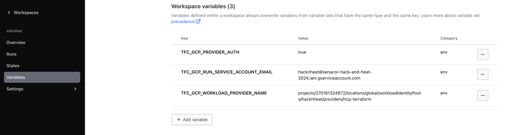

# Configuration of HCP Terraform

## 1. Create a workspace and link it to you GitHub repository

## 2. Connect your workspace via Workload Identity Federation to the Hack&Heat GCP project

To connect the workspace using WIF to GCP add the following env vars to the workspace:

- `TFC_GCP_PROVIDER_AUTH`: `true`
- `TFC_GCP_RUN_SERVICE_ACCOUNT_EMAIL`: `hacknheat@senacor-hack-and-heat-2024.iam.gserviceaccount.com`
- `TFC_GCP_WORKLOAD_PROVIDER_NAME`: `projects/370161324872/locations/global/workloadIdentityPools/hacknheat/providers/hcp-terraform`

